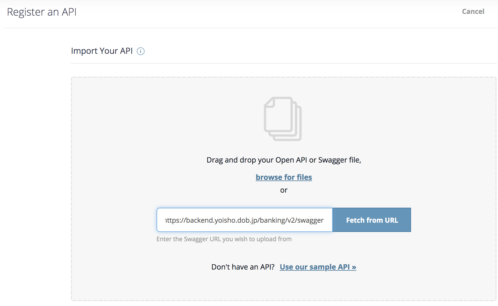
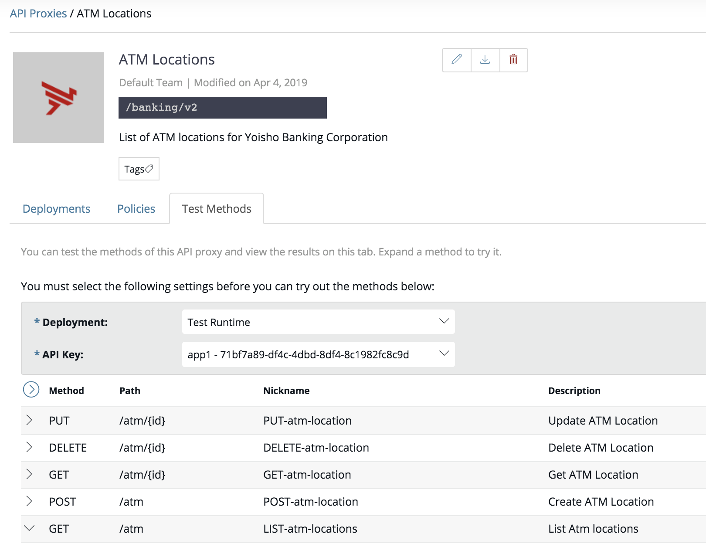

# Virtualize, Publish & Consume an API with Amplify Central

## Objectives

In this lab you will:

* import an API Swagger into Amplify Central
* add API Key authentication
* deploy the API endpoint
* publish the API in Amplify Central Catalog
* consume using Postman and cURL

## You need:

* Access to [https://apicentral.axway.com](https://apicentral.axway.com)
* Browser, cURL, Postman

## Step 1: Use Open Banking Endpoint

For this exercise you're going to use an endpoint from the [Yoisho Open Banking project](https://github.com/u1i/yoisho). Let's check out the live endpoints here: [https://backend.yoisho.dob.jp/](https://backend.yoisho.dob.jp/)

Have a look at the ATM Locator API which exposes a full CRUD interface:

Swagger: [https://backend.yoisho.dob.jp/banking/v2/swagger](https://backend.yoisho.dob.jp/banking/v2/swagger)

Example Request:

> curl https://backend.yoisho.dob.jp/banking/v2/atm/1
> 
> {"lat": "35.6284713", "lon": "139.736571", "location": "Shinagawa Station"}

## Step 2: Import API into Amplify Central

When you login into Amplify Central, you should see a 'Welcome' dialog that looks like this:

Let's click on 'Register an API' and paste the Swagger URL from the ATM endpoint into the upcoming dialog:

Amplify Central should pull all the information and display it:

Click 'Save' and the endpoint should now have been imported successfully as a 'Proxy'.

## Step 3: Add API Key Authentication

In the 'Policy' tab for the API you can now click on 'Client Authentication': 

This opens a dialog where you can select 'API Key' - leave the API Key Location at the default setting with is the Header section.

## Step 4: Deploy API Proxy to 'Test'

Go back to the API Proxy and navigate on the 'Deployments' tab. Click the 'Deploy' button next to the 'Test Runtime':

After a moment you should see an updated view that shows the newly provisioned URL of the endpoint:

## Step 5: Create an App so you can use the API

If you go to 'Test Methods' Amplify Central will tell you that you need an app along with an API Key to use the API:

So let's do exactly that. Click on 'Apps' in the top navigation on the left side and create an app named 'app1' (or any other name you like):

After that, click on 'API Keys' and generate one by clicking the + button:

Now you can add the 'ATM Locations' API to this app:

## Step 6: Test API with API Key

Now head back to 'Test Methods' - you should see that 'Test Runtime' and your API Key is automatically selected.

The methods should all work (please note: the live endpoints cannot be used to add, delete or update data but they will give the correct response codes:

Amplify Central also gives you the cURL command - try it out! There is also a Swagger download which you can import into Postman.

# Step 7: Add API to Amplicy Central Catalog

Click the 'Add to Catalog' button next to the Proxy Runtime:

You can change the name and add a thumbnail image for the catalog:

When you're done click 'Add to Catalog':

Voila! We now have 'ATM Locations' published:

